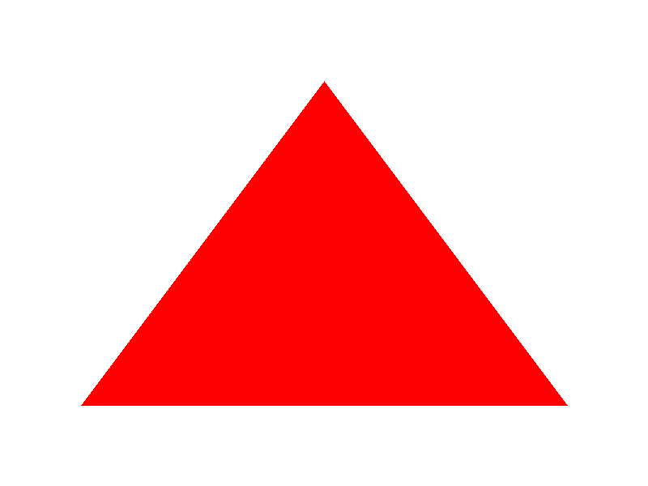
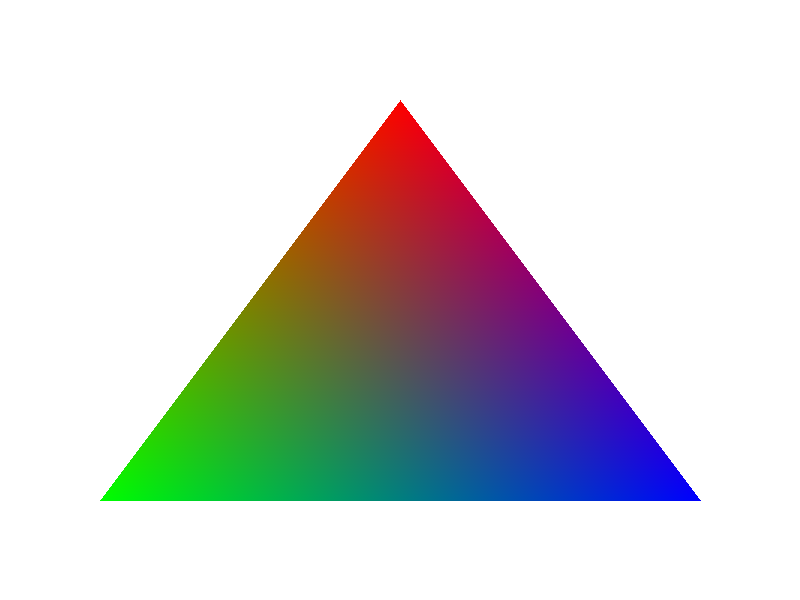
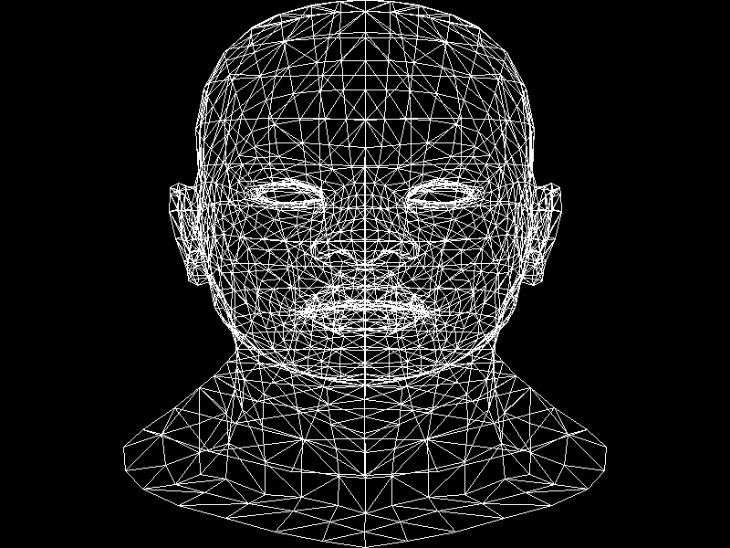
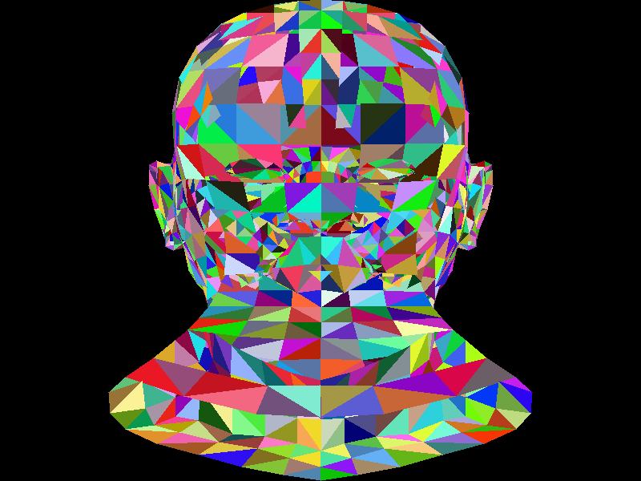
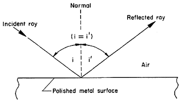
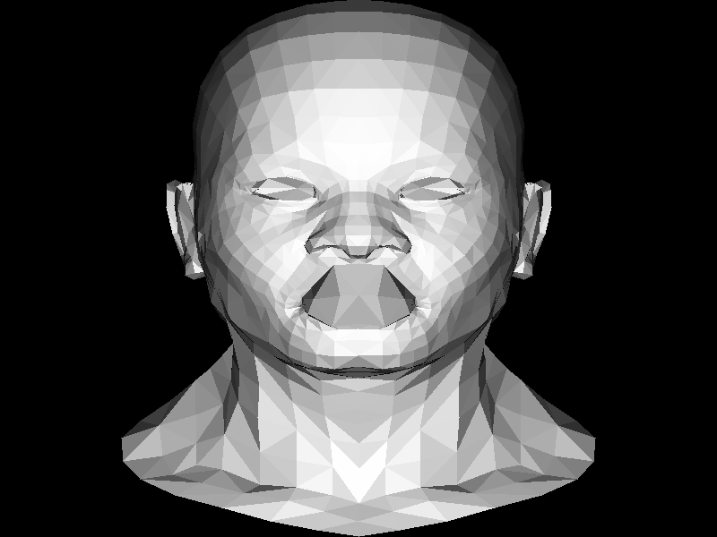

# TinyRender
> A project to learn how OpenGL Works.    
>Use TGA Image to hold render result, so not depend on any platform Window system.
### BasicTriangle Render Algrithom
. Use Triangle center of gravity to decided whether a pixle is inside a Triangle.
The algrithom is like this:
```c++
/*
P = (1 - u - v) x A + u x B + v x C 
AP = u x AC + v x AB 
u x AC + v x AB + PA = 0
u x (c - a) + v x (b - a) + (a - p) = 0

| u x (c - a)[0] + v x (b - a)[0] + (a - p)[0] = 0
| u x (c - a)[1] + v x (b - a)[1] + (a - p)[1] = 0
*/
```
the full code is in [Triangle.cpp](./example/Triangle.cpp)    
Result like this:    

### ColorTriangle Render
. The center of gravity algrithom can also be used to do color interpolation. Just like glsl keyworkd `varying`    
The code segment like this:    
```c++
Vec2i p;
for (p[0] = leftTop[0]; p[0] <= rightBottom[0]; p[0]++) {
    for (p[1] = leftTop[1]; p[1] <= rightBottom[1]; p[1]++) {
        Vec3f bc_screen = barycentric(a, b, c, p);
        if (bc_screen[0] < 0 || bc_screen[1] < 0 || bc_screen[2] < 0) continue;

        mImage->set(p[0], p[1], color);
    }
}
```
And full code is in [ColorTriangle.cpp](./example/ColorTriangle.cpp)
Result like this:    

### Load obj format 3D model
>A obj format 3D model is just a txt file. With vertex information write in line. So we can use c++ input stream to read and parse a model. In the begining we just draw a white frame model.
The code is in [Wireframe.cpp](./example/Wireframe.cpp)    
And render result is:    

### Draw 3D model faces
> When drawing 3D model, it's actually drawing triangles. Many small traingles togethor can make a smooth surface. For Simplicity, we use random color to render model triangle.

The code segment like this:    
```c++
Model model(model_path.c_str());
/** draw all vertex triangle ***/
for (size_t i = 0; i < model.nfaces(); i++) {
    std::vector<int> face = model.face(i);
    Vec2i triangle[3];
    for(size_t j = 0; j < 3; j++) {
        Vec3f c = model.vert(face[j]);
        c[0] = (c[0] + 1.f) * WIDTH / 2.f;
        c[1] = (c[1] + 1.f) * HEIGHT / 2.f;
        triangle[j][0] = (int)c[0];
        triangle[j][1] = (int)c[1];
    }
    TGAColor randomColor(rand() % 255, rand() % 255, rand() % 255);
    TGAColor colors[] = { randomColor, randomColor, randomColor };
    render.triangle(triangle, colors);
}
```
Full code is in [RandomColorModel.cpp](./example/RandomColorModel.cpp)    
And render result is:    


### Light effect and depth buffer
> In previous demo, the image can see the contour of the model. But the render result is looking strange. The reason is some front triangles blocked by other triangles. To fix this error, we need an other buffer to store the depth of each pixle. And every time we draw a new pixle color, we need to check if the `z` value is bigger than the previous one.

So we create a `depth buffer` like this:    
```c++
mZBuffer = new float[width * height];
for(size_t i = 0; i < width * height; i++) {
    mZBuffer[i] = -std::numeric_limits<float>::max();
}
```
And do the `depth test` like this:    
```c++
if (mZBuffer[ int(p.x + p.y * mImage->get_width()) ] > pz) continue;
```
Now let's deal with the light effect:    
Basicly we only calculate the specular reflection result. And the color value is simple multiply the cosin value between light direction and face normal direction like this:    
    

So the render code segment is like this:    
```c++
Vec3f light_dir;
light_dir[0] = 0;
light_dir[1] = 0;
light_dir[2] = -1.f;

...

Vec3f normal = ((vectors[2] - vectors[0])^(vectors[1] - vectors[0])).normalize();        
float indensity = normal * light_dir;

...

float indensity = normal * light_dir;
        
if (indensity > 0) {
    TGAColor color(255 * indensity, 255 * indensity, 255 * indensity);
    TGAColor colors[] = { color, color, color };
    render.triangle(triangle[0], triangle[1], triangle[2], color);
}

```
And the render result me like this:    
